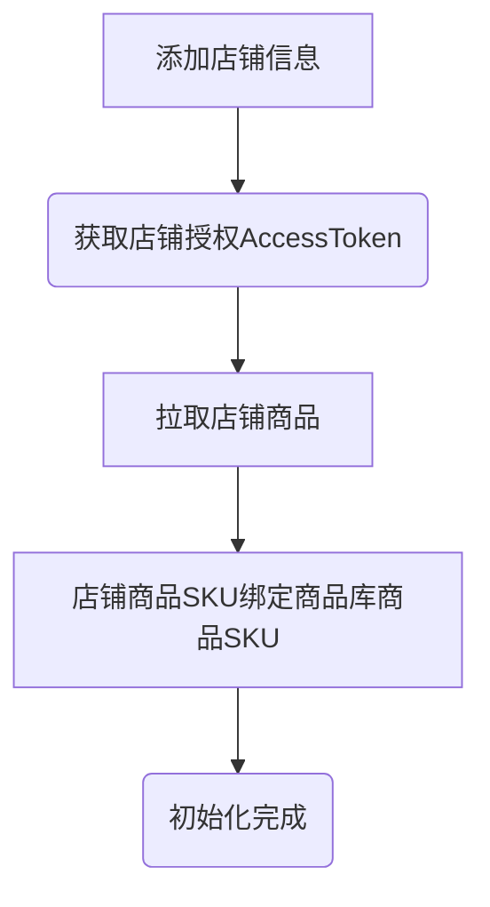
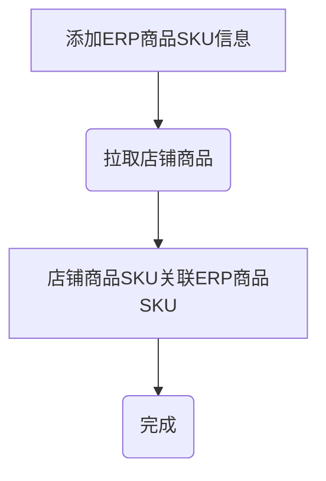
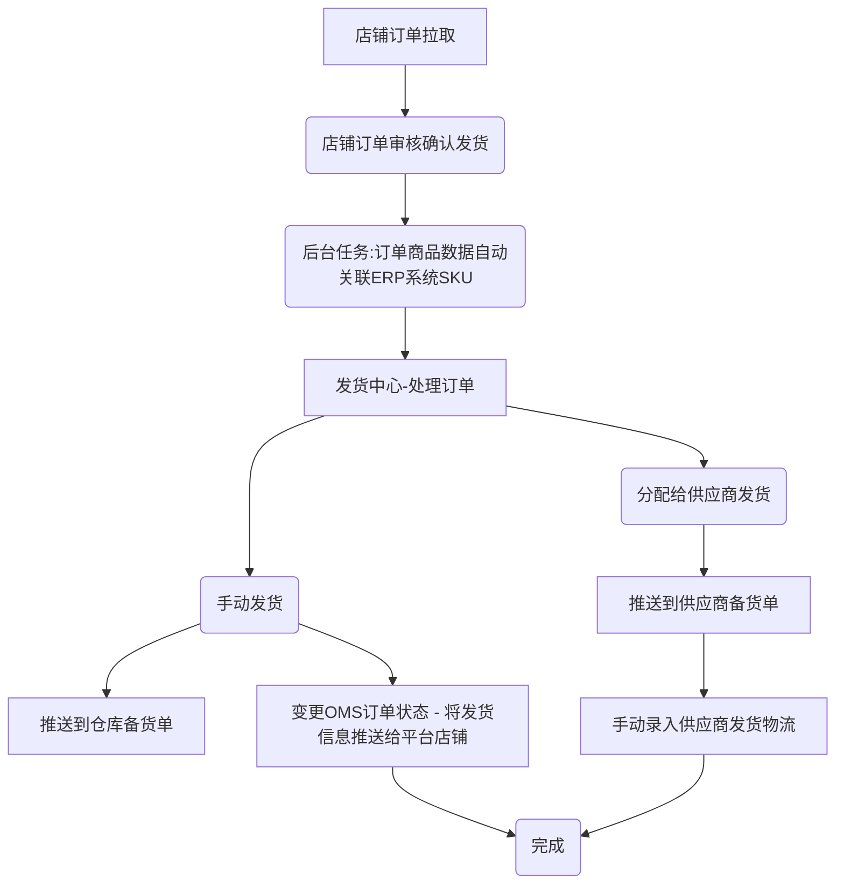
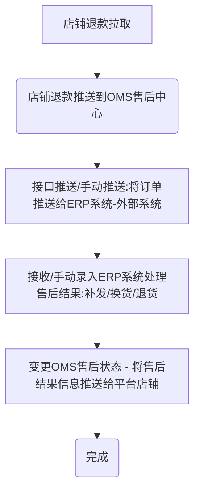

# 启航电商ERP系统-电商企业数字化底座

> **欢迎来到我们的开源项目！创新、协作、高质量的代码。您的Star🌟，是我们前进的动力！ 💪✨🏆**

> **项目持续更新中，还有很多不足，请多包含！如有任何疑问请提交issuse！谢谢！ 💪✨🏆**

> **启航电商ERP系统正在重构AI原生ERP系统——不光能用，还能和您的飞书/钉钉/企微等外部系统紧密协作，越用越智能。**


## 🎉 4.1版本重大升级

### 🚀 核心技术栈升级

| 组件 | 版本 | 说明 |
|------|------|------|
| **Spring Boot** | **4.1.0** | 从 3.0.2 升级，基于 Spring Framework 7.x |
| **Spring Security** | 7.1.0 | 安全框架升级，API 变更适配 |
| **Spring Data Redis** | 4.1.0 | Redis 数据层升级 |
| **Tomcat** | 11.0.22 | Servlet 6.x 支持 |
| **Java** | 17 | 保持兼容，无需升级 JDK |
| **MyBatis-Plus** | 3.5.16 | spring-boot4-starter 适配 |
| **Spring AI** | **2.0.0** | 大模型统一接入框架，新增 @Tool 原生函数调用 |
| **jjwt** | 0.12.6 | JWT 库升级，API 变更 |
| **OkHttp** | 4.12.0 | HTTP 客户端，用于外部 Webhook 消息推送 |

### 🤖 AI原生ERP——Spring AI 2.0 + 11个AI Tool 全面就绪

> **🔥 开源版已深度集成 Spring AI 2.0，构建了完整的 AI Tool 函数调用体系，DeepSeek 驱动的智能助手可直接查询数据库、分析业务数据！**

| 特性 | 描述 | 状态 |
|------|------|------|
| **Spring AI 2.0** | 官方 AI 框架，统一大模型接入 + @Tool 注解函数调用 | ✅ 已深度集成 |
| **DeepSeek 大模型** | 通过 OpenAI 兼容 API 接入 DeepSeek | ✅ 内置，配置 API Key 即用 |
| **11 个 AI Tool 类** | 订单、商品、库存、售后、采购、物流、会员等原子查询工具 | ✅ 已实现 |
| **ChatClient + SSE 流式输出** | 流式对话，逐字返回，用户体验流畅 | ✅ 已实现 |
| **AI 定时监控** | 定时 AI 分析库存异常、订单超时等并推送通知 | ✅ 已实现 |
| **SSE 实时推送** | 新订单、新消息浏览器弹窗提醒 | ✅ 已实现 |
| **RAG 知识库** | PGVector 向量存储 + 检索增强生成 | 🔧 需部署 pgvector 启用 |
| **文档读取器** | PDF/HTML/JSoup/Tika 文档解析 | 🔧 按需启用 |

**启用 AI 功能：** 配置 `application.yml` 中的 `spring.ai.deepseek.api-key`，重启即可在「AI 智能」菜单体验自然语言查询。

### 🔔 外部通知提醒——让 ERP 主动找到你

> **运营异常不再靠人盯——系统自动推送飞书/钉钉/企微，消息直达手机！**

| 特性 | 描述 | 状态 |
|------|------|------|
| **飞书机器人** | 通过 Webhook 推送 ERP 消息到飞书群 | ✅ 已实现 |
| **钉钉机器人** | 支持签名校验，安全推送钉钉群 | ✅ 已实现 |
| **企业微信机器人** | 推送消息到企微群 | ✅ 已实现 |
| **通知渠道管理** | 可视化配置 Webhook 地址、测试推送 | ✅ 已实现 |
| **自动重试** | 推送失败自动重试（10分钟间隔） | ✅ 已实现 |
| **分级推送策略** | 高优消息 → 外推，低优 → 系统内通知 | ✅ 已实现 |
| **SSE 浏览器实时通知** | 系统新消息实时弹窗，无需刷新 | ✅ 已实现 |

### 4.1 核心特性

| 特性 | 描述 | 状态 |
|------|------|------|
| **多商户架构** | 商户独立管理店铺、商品、采购、订单、出入库 | 🔧 开发中 |
| **多仓库支持** | 本地仓、系统云仓、京东云仓 | 🔧 开发中 |
| **多供应商支持** | 供应商发货处理、备货单管理 | 🔧 开发中 |
| **AI 原生集成** | Spring AI 2.0 + 11个@Tool + DeepSeek 智能分析 | ✅ 已实现 |
| **外部通知系统** | 飞书/钉钉/企微 Webhook 推送 + 通知渠道管理 | ✅ 已实现 |
| **完整进销存** | 采购、销售、出入库全流程管理 | 🔧 开发中 |
| **三级销售架构** | 总部-商户-店铺三级体系 | 🔧 开发中 |


## 一、系统介绍

**启航电商ERP系统正在重构AI原生ERP系统。**

#### 项目定位

**启航电商ERP系统是一个驱动电商企业数智化转型的电商业务中台底座。**

该项目基于 Spring Boot 4.1 单体应用架构，通过 OpenAPI + CLI 构建供 AI 调用的系统，实现 AI 原生电商 ERP 系统。AI场景包括：

+ 完整的供AI大模型调用的开放接口（持续完善中）；
+ CLI命令行工具（AI使用范例）；
+ 接入大模型数据分析（持续更新中）；


系统支持多平台多店铺管理，拥有商品、订单、售后、库存、电子面单等电商核心业务处理能力，支持：淘宝、京东、拼多多、抖店、微信小店、快手、小红书等。

主体功能包括：采购管理、商品管理、订单管理、售后管理、发货管理、仓库管理等。

**系统拥有完善的对外开放接口，可以很方便地与企业原有其他ERP、WMS、财务等系统进行对接。**

**商业版支持多商户、多供应商、多仓库独立子系统处理业务，还对接了京东云仓可以直接将订单推送到京东云仓发货**

**该系统可作为电商企业数字化转型的订单中台系统底座使用，教程及文档请阅读开源文档或者访问官网：qihangerp.cn**

---

##### 💡 申请不到平台 API (AppKey) 怎么办？

**启航电商 ERP** 专为大中型电商设计，依赖官方 API 实现自动化。如果您面临以下情况：
* ❌ 无法申请淘宝、抖音、拼多多等平台的官方 API 权限
* ❌ 需要快速部署生产环境，不想折腾开源版
* ❌ 需要专业的技术支持和售后服务

**欢迎升级到启航电商ERP商业版：**

👉 **[启航电商ERP商业版](https://qihangerp.cn)**

* **API无忧**：提供平台API协助申请，或者采用第三方API接口服务（商业版内置了第三方API）
* **一键部署**：专业运维团队协助上线
* **专属支持**：7x24小时技术支持服务
* **更多功能**：多商户架构、多仓库支持、第三方API支持、三方云仓（如：京东云仓）支持、AI智能分析

---

**如果您只需要订单处理功能，不需要完整ERP：**

👉 **[启航电商OMS订单中台](https://qihangerp.cn/oms.html)**

* **多平台聚合**：支持淘宝、京东、拼多多、抖店、微信等平台订单统一管理
* **灵活处理**：支持API自动拉单 + 手动导入订单双模式
* **轻量部署**：单体架构，30分钟部署完成，开源可定制
* **数据自有**：完全本地部署，数据100%自主掌控

---

### 💡 自研 vs 购买：算一笔账

有能力部署开源版的团队，通常会纠结一个问题：**用开源版自己维护，还是直接买商业版？**

| 成本项 | 自研（基于开源版二次开发） | 购买商业版 |
|:------|:------------------------|:----------|
| 技术团队 | 至少 1-2 人维护（年薪 30-50 万） | 无需组建 |
| 开发周期 | 3-6 个月熟悉代码和二次开发 | 即买即用 |
| 平台对接 | 逐个申请 AppKey、调试接口 | 已对接所有主流平台 |
| 持续迭代 | 自己跟进平台 API 变更 | 商业版负责更新 |
| 多商户/多仓库 | 需自行开发 | 商业版内置 |
| 风险 | 人员离职、代码质量问题 | 厂商保障 |
| **年成本** | **30-50 万+** | 源码买断，永久授权，无需年费|

> **结论：** 如果你的团队有技术能力且有空闲人力，开源版是不错的底层框架；如果你需要快速上线、降低风险，**商业版是更经济的选择**。

---
## 二、核心流程与功能


### 关键流程
#### 平台初始化流程


#### 绑定商品库商品SKU



#### 处理订单（发货）



#### 处理售后




### 🤖 AI 智能助手——用自然语言管理生意

系统内置 **Spring AI 2.0 + DeepSeek** 智能对话引擎，AI 可自主调用数据库查询工具回答业务问题：

```
💬 "最近一周哪个店铺退款最多？"
→ AI 自动调用 RefundTools 查询数据 → "近7天拼多多旗舰店退款42单，金额最高..."

💬 "库存不足的商品有哪些？"
→ AI 调用 InventoryTools 查询 → "商品A (SKU12345) 仅剩3件，商品B (SKU67890) 已售罄..."

💬 "上个月采购订单统计"
→ AI 调用 PurchaseTools 查询 → "5月共生成采购订单18单，总金额￥256,800..."
```

#### 已实现的 AI 工具（11个 @Tool 类）

| 工具类 | 功能 | 查询范围 |
|-------|------|---------|
| `ShopTools` | 店铺信息查询 | 店铺列表、平台类型、授权状态 |
| `OrderTools` | 订单数据查询 | 订单列表、订单明细、发货状态、待发货统计 |
| `RefundTools` | 售后数据查询 | 售后列表、退款原因汇总、退款金额统计 |
| `GoodsTools` | 商品信息查询 | 商品列表、SKU 明细、分类、品牌 |
| `InventoryTools` | 库存信息查询 | 库存列表、低库存预警、库存流水 |
| `PurchaseTools` | 采购信息查询 | 采购订单列表、采购明细、供应商 |
| `MemberTools` | 会员信息查询 | 会员列表、会员等级、积分 |
| `SupplierTools` | 供应商查询 | 供应商列表、报价 |
| `LogisticsTools` | 物流信息查询 | 物流公司、运单状态 |
| `WarehouseTools` | 仓库信息查询 | 仓库列表、库位查询 |
| `StockFlowTools` | 库存流水查询 | 出入库流水、按时间/商品筛选 |

> AI 会自行判断需要调用哪些工具、按什么顺序调用，无需用户关心底层数据表结构。

### 🔔 外部通知提醒——运营异常主动找上门

系统遇到运营异常（销售额为零、退款过多、库存不足、发货超时等），会自动通过您配置的通知渠道推送到手机：

```
┌─ 系统定时检查 ─────────────────────┐
│                                     │
│  sales_zero?  → "今日销售额为零"     │
│  ship_pending? → 发货积压提醒        │
│  refund_excess? → "退款过多提醒"     │
│  stock_low?   → 库存不足警报         │
│  order_timeout? → 发货超时提醒       │
│  AI 分析异常  → 智能识别运营风险      │
│                                     │
└─────────┬───────────────────────────┘
          │
          ▼
  ┌───────┴───────┐      ┌──────────────────┐
  │  sys_message   │ ───→ │  浏览器弹窗提醒    │
  │  (系统消息表)   │      │  (SSE 实时推送)   │
  └───────┬───────┘      └──────────────────┘
          │
          ▼
  ┌───────┴───────────────────┐
  │  NotifierService 分发      │
  │  (根据 sys_alert_channel)  │
  └───────┬───────────────────┘
          │
    ┌─────┼──────────┬─────────┐
    ▼     ▼          ▼         ▼
  飞书   钉钉       企微      (更多)
  Webhook Webhook   Webhook    扩展
```

**推送策略：**
- 🔴 **高优先级**（销售额为零、库存不足、AI 识别异常） → 实时推送到外部
- 🟡 **中优先级**（发货积压、退款过多） → 系统内通知 + 有条件外推
- 🔵 **低优先级**（常规通知） → 仅系统内通知

### 主体功能

启航电商ERP系统支持多平台多店铺订单、售后、商品等管理，目前已接入：淘宝、京东、拼多多、抖店、微信小店，后续会继续接入快手小店、小红书等。

启航电商ERP系统逐步演变成了一个完整的ERP，主体功能包括：

+ **🤖 AI 智能分析**：自然语言查询业务数据、AI 定时监控运营风险
+ **🔔 外部通知推送**：飞书/钉钉/企微 Webhook 推送、通知渠道可视化配置
+ **采购管理**：采购单管理、采购单入库、供应商管理等
+ **商品管理**：
  + 商品库管理：商品、分类&分类属性管理等
  + 店铺商品管理：店铺商品同步、关联ERP商品等
+ **订单管理**：
  + 订单库：所有平台所有店铺订单聚合
  + 店铺订单管理：店铺订单同步、管理
+ **发货管理**：
  + 电子面单打印发货
  + 手工发货管理
  + 供应商发货管理
  + 发货记录、物流跟踪等
  + 店铺电子面单账户管理
  + 发货设置
+ **售后管理**：店铺售后同步、售后处理（补发、换货、退货处理）等
+ **店铺&平台参数设置**：店铺管理、店铺商品管理、平台参数设置


#### 系统架构

本项目后端采用`Spring Boot 4.1` + `Spring AI 2.0` 架构开发。

前端采用`Vue3`+`TypeScript`+`Element Plus`开发（`vue3/` 为新版前端，`vue2/` 为旧版前端）

+ 后端核心技术栈
  + **Spring Boot 4.1.0** — 最新稳定版，基于 Spring Framework 7.x
  + **Spring Security 7.1** — 安全认证与授权
  + **Spring AI 2.0** — AI 大模型统一接入框架，@Tool 函数调用
  + **OkHttp 4.12** — HTTP 客户端，用于飞书/钉钉/企微 Webhook 推送
  + **MyBatis-Plus 3.5.16** — 持久层框架
  + **MySQL 8 + Redis 7** — 数据库与缓存
  + **SSE** — 服务端实时消息推送


## 三、功能模块（系统菜单一览）

系统菜单结构如下，基于数据库中 `sys_menu` 配置动态渲染：

#### 1️⃣ 商品管理
| 菜单 | 说明 |
|------|------|
| 商品库管理 | 商品库商品增删改查、SKU管理、供应商产品关联 |
| 店铺商品管理 | 店铺商品同步、ERP商品SKU绑定 |
| 商品库存查询 | 库存明细查询 |
| 商品分类管理 | 商品分类维护 |
| 商品品牌管理 | 商品品牌维护 |
| 分类规格属性 | 分类属性配置 |
| 供应商产品 | 供应商产品信息维护 |

#### 2️⃣ 销售管理（订单管理）
| 菜单 | 说明 |
|------|------|
| 订单库 | 所有平台所有店铺订单聚合展示 |
| 订单明细 | 订单商品明细查询 |
| 店铺订单 | 各平台店铺订单同步与管理 |
| 创建内销订单 | 线下/内销订单录入 |
| 内销管理 | 内销订单审核处理 |
| 折扣管理 | 营销折扣规则配置 |
| 会员管理 | 会员信息管理 |

#### 3️⃣ 采购管理
| 菜单 | 说明 |
|------|------|
| 采购订单 | 采购单创建、审核、查询 |
| 采购入库 | 采购物流、收货、生成入库单 |
| 供应商档案 | 供应商信息维护 |
| 供应商报价 | 供应商价格管理 |
| 采购承运商 | 承运商管理 |

#### 4️⃣ 发货管理
| 菜单 | 说明 |
|------|------|
| 手动发货 | 手工录入发货信息 |
| 打单发货 | 电子面单打印发货 |
| 供应商发货 | 分配给供应商代发 |
| 云仓发货 | 推送到云仓发货 |
| 发货记录 | 发货记录查询 |
| 电子面单设置 | 店铺电子面单账户配置 |
| 发货快递设置 | 发货快递公司配置 |

#### 5️⃣ 售后管理
| 菜单 | 说明 |
|------|------|
| 订单售后库 | 聚合售后查询、详情、处理 |
| 店铺售后 | 售后API拉取、更新、操作 |
| 售后台账 | 售后处理记录台账 |

#### 6️⃣ 仓库管理
| 菜单 | 说明 |
|------|------|
| 订单发货出库 | 备货单生成、出库作业 |
| 出库管理 | 商品出库单管理 |
| 入库管理 | 商品入库单管理 |
| 仓库商品 | 仓库商品库存查询 |
| 仓库管理 | 仓库信息维护 |
| 仓位管理 | 仓库库位配置 |

#### 7️⃣ 店铺管理
| 菜单 | 说明 |
|------|------|
| 店铺管理 | 店铺信息维护、授权管理 |
| 商户管理 | 多商户管理（总部-商户-店铺三级架构） |

#### 8️⃣ 系统设置
| 菜单 | 说明 |
|------|------|
| 用户管理 | 系统用户管理 |
| 角色管理 | RBAC角色权限配置 |
| 菜单管理 | 动态菜单配置 |
| 部门管理 | 组织架构管理 |
| 字典管理 | 数据字典维护 |
| **通知渠道** | **飞书/钉钉/企微 Webhook 配置、测试推送** |

#### 🔟 AI 智能
| 菜单 | 说明 |
|------|------|
| 模型配置 | AI 大模型接入配置（DeepSeek/Ollama 等） |
| 智能分析 | AI 对话分析，自然语言查询业务数据 |

#### 9️⃣ 系统&接口配置
| 菜单 | 说明 |
|------|------|
| 接口授权 | OpenAPI 鉴权管理（appKey/appSecret） |
| 电商平台开关 | 各平台API开关控制 |
| 定时任务配置 | 订单拉取等定时任务管理 |
| 平台拉取日志 | 订单/售后拉取日志查询 |
| 快递公司库 | 物流公司库维护 |
| 国家地区设置 | 地区数据维护 |

## 四、项目架构
### 1、开发环境级组件
#### 1.1 开发环境
+ Java：17
+ Nodejs：v20.20.0
+ Maven：3.9
+ Spring Boot：4.1.0
+ Spring AI：2.0.0

#### 1.2、存储及中间件

+ MySQL 8
+ Redis 7.x


### 2、项目结构
#### 2.1 `common`通用公共库
+ 通用工具类、结果封装（ResultVo、PageQuery等）、工具函数等

#### 2.2 `security`安全模块
+ 权限认证、JWT Token管理、Spring Security 7.x 配置

#### 2.3 `model`领域模型层
+ `entity`: 数据库实体类（ShopOrder、OOrder、OGoods、OShop等）
+ `bo`: 业务对象（TaoOrderBo、JdOrderBo等）
+ `vo`: 视图对象（UserInfoVo、MenusVo等）
+ `dto`: 数据传输对象

#### 2.4 `mapper`数据访问层
+ MyBatis-Plus Mapper接口，数据持久化

#### 2.5 `service`业务服务层
+ Service接口与实现统一层，包含Mapper、业务接口及实现
+ 包含商品、订单、店铺、售后等各模块的数据访问和业务逻辑

#### 2.6 `erp-api`单体应用（主入口）
+ Spring Boot 4.1 单体应用，统一端口 8088
+ 按业务领域分包：

| 包 | 功能 |
|---|------|
| `controller/erp/` | ERP核心业务（商品、订单、采购、仓库、库存、售后等） |
| `controller/oms/` | 平台对接（淘宝/京东/拼多多/抖店/微信小店/快手 OAuth、订单、售后、面单） |
| `controller/sys/` | 系统管理（用户、角色、菜单、字典、登录、通知渠道等） |
| `controller/open/` | 开放API接口（供AI/外部系统调用） |
| `controller/ai/` | AI相关（SSE推送、Ollama、DeepSeek、Chat） |
| `notify/` | **外部通知推送（飞书/钉钉/企微 Notifier + 分发服务）** |
| `serviceImpl/ai/` | **AI 工具类（11个 @Tool 类：ShopTools、OrderTools、RefundTools 等）+ 编排服务** |
| `serviceImpl/` | AI 监控调度、消息调度、业务服务实现 |
| `mq/` | 消息队列（Kafka消息消费） |

#### 2.7 `open-sdk`平台对接SDK
+ 各电商平台API对接封装（淘宝、京东、拼多多、抖店、微信小店、快手、小红书）
+ 包含Token管理、订单/商品/售后/物流API、电子面单等


### 3、运行说明
#### 3.1、启动环境

1. 启动MySQL 8
2. 启动Redis 7

> v4.1 版本已重构为**单体应用**，无需分布式组件，启动更简单。

#### 3.2、导入数据库
+ 创建数据库`qihang-erp`
+ 导入数据库结构：sql脚本`docs\qihang-erp.sql`

#### 3.3、启动后端服务
```bash
# 编译打包
mvn clean install

# 运行（默认端口 8088）
java -jar erp-api/target/erp-api.jar
```

#### 3.4、运行前端
+ Nodejs版本：v20.20.0
+ 进入`vue3`文件夹（新版前端，Vue3 + TypeScript + Vite）
+ 运行`npm install`
+ 运行`npm run dev`
+ 浏览网页（默认端口 88）
+ 登录账号：`admin`
+ 登录密码：`QHerp@23`

> 旧版前端（Vue2 + ElementUI）位于 `vue2/` 目录，仍可使用，后续将逐步迁移到 `vue3/`。

#### 3.5、SSE 实时消息推送 & 外部通知
系统支持双通道消息推送：

**🔔 通道一：SSE 浏览器实时推送**
- 新订单消息、系统通知实时弹窗，无需手动刷新
- 支持服务端主动推送（新订单提醒、AI 分析结果等）

**🔔 通道二：外部 Webhook 推送（飞书/钉钉/企微）**
- 在「系统设置 → 通知渠道」中配置 Webhook 地址
- 支持飞书、钉钉（含签名校验）、企业微信
- 运营异常自动推送：销售额为零、退款过多、库存不足、发货超时、AI 识别异常
- 推送失败自动重试（间隔 10 分钟）
- 支持可视化「测试消息」验证配置是否正确

**开发环境**：前端 devServer proxy 已默认支持 SSE 长连接代理。

**生产环境（Nginx）**：需要配置以下关键参数：
```nginx
location /prod-api/ {
    proxy_http_version 1.1;    # 必须 HTTP/1.1
    proxy_buffering off;       # 关闭缓冲
    proxy_read_timeout 1800s;  # 长连接超时
    proxy_pass http://127.0.0.1:8088/;
}
```

### 4、项目部署

#### 4.1 打包

##### 后端打包
+ 1、install

  `mvn clean install`
+ 2、package

  `mvn clean package`

##### 前端打包
```bash
cd vue3     # 新版前端（Vue3），vue2/ 为旧版前端
npm run build
```

#### 4.2 部署
##### 后端部署

+ jar部署

+ docker部署

##### 前端部署
+ Nginx配置
```
# 处理 /prod-api/ 的代理请求
location /prod-api/ {
    proxy_set_header Host $http_host;
    proxy_set_header X-Real-IP $remote_addr;
    proxy_set_header REMOTE-HOST $remote_addr;
    proxy_set_header X-Forwarded-For $proxy_add_x_forwarded_for;
    # --- 新增 SSE 关键配置 ---
    proxy_http_version 1.1;       # 必须使用 HTTP/1.1
    proxy_buffering off;          # 关闭缓冲，确保数据实时发送
    proxy_read_timeout 1800s;     # 增加读取超时时间 (例如 30 分钟)
    proxy_send_timeout 1800s;     # 增加发送超时时间 (例如 30 分钟)
    proxy_connect_timeout 60s;    # 连接超时时间
    # --- 结束新增 ---

    proxy_pass http://127.0.0.1:8088/;
}
```
+ docker运行

---

## 📦 启航电商开源生态

启航电商旗下开源项目矩阵：

| 项目               | 定位                                     | Gitee | GitHub                                                  |
|:-------------------|:-----------------------------------------|:-----|:--------------------------------------------------------|
| **启航电商ERP ⬅** | **电商业务AI底座（单体应用，v4.1）**     | [Gitee](https://gitee.com/qiliping/qihang-erp-open) | [GitHub](https://github.com/zeasin/qihang-erp-open)     |
| OMS 订单中台       | 轻量级订单管理                           | [Gitee](https://gitee.com/qiliping/qihang-oms) | [GitHub](https://github.com/zeasin/qihang-oms)          |
| 启航零售ERP       | 线下零售管理平台                         | [Gitee](https://gitee.com/qiliping/qihang-retail) | [GitHub](https://github.com/zeasin/qihang-retail)          |
| 启航跨境电商ERP    | 跨境电商专用版       | [Gitee](https://gitee.com/qiliping/qihang-cb-erp) | [GitHub](https://github.com/zeasin/qihang-cb-erp)                                          |

## 💼 商业版

👉 **[启航电商ERP商业版](https://qihangerp.cn)**

👉 **了解更多？→** 邮箱：qihangerp@qq.com


## 📱 关注我们

|                   公众号：启航电商ERP                   |                   个人号：码农老齐                   |
|:-----------------------------------------------:|:--------------------------------------------:|
|                 产品动态·行业方案·客户案例                  |                技术实战·开源故事·创业心得                |
|  |  |


**感谢关注！我希望将从事电商 10 余年的行业经验沉淀在代码中，帮助大家真正提升经营效率。**

💖 如果项目对您有帮助，请点个 **Star ⭐** 给予鼓励！


---


